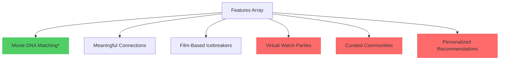
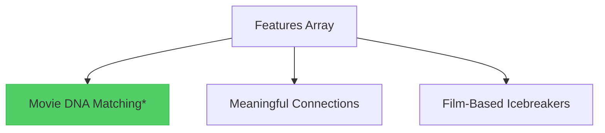

# Feature Removal Design Document

## Overview

This document outlines the removal of specific features from the CineMatch landing page that are not yet implemented in the platform. The goal is to align the landing page content with the current product roadmap by removing references to Virtual Watch Parties, Curated Communities, and Personalized Recommendations features.

## Features to Remove

### 1. Virtual Watch Parties
- **Current Description**: "Watch movies together online and discuss them in real-time"
- **Location**: Solution section features grid
- **Icon**: Calendar (lucide-react)
- **Status**: Remove completely

### 2. Curated Communities  
- **Current Description**: "Join groups based on genres, directors, or specific film interests"
- **Location**: Solution section features grid
- **Icon**: Users (lucide-react)
- **Status**: Remove completely

### 3. Personalized Recommendations
- **Current Description**: "Discover new films through people who share your taste"
- **Location**: Solution section features grid  
- **Icon**: Sparkles (lucide-react)
- **Status**: Remove completely

## Component Impact Analysis

### Solution Section Component
**File**: `components/sections/solution.tsx`

#### Current Features Array Structure

#### Updated Features Array Structure

### FAQ Section Component
**File**: `components/sections/faq.tsx`

#### FAQ Items to Remove
- **Question**: "How do virtual watch parties work?"
- **Answer**: References virtual watch party functionality
- **Index**: Item 4 in the FAQ array

## UI Layout Considerations

### Grid Layout Impact
- **Current**: 3-column layout (lg:grid-cols-3) with 6 features
- **Updated**: 3-column layout with 3 features (1 row instead of 2)
- **Responsive**: Mobile remains single column, tablet remains 2-column

### Visual Balance
The removal of 3 features will result in:
- Cleaner, more focused feature presentation
- Reduced cognitive load for users
- Better emphasis on core features
- Maintained grid alignment with 3 remaining features

## Content Strategy Adjustments

### Value Proposition Focus
With fewer features displayed, the landing page will emphasize:
1. **Movie DNA Matching** - Core algorithmic matching
2. **Meaningful Connections** - Relationship building focus  
3. **Film-Based Icebreakers** - Conversation facilitation

### Benefits Section Retention
The "Why CineMatch Works" section remains unchanged as it focuses on core value propositions rather than specific features.

## Implementation Plan

### Phase 1: Solution Section Updates
1. Remove Virtual Watch Parties feature object from features array
2. Remove Curated Communities feature object from features array  
3. Remove Personalized Recommendations feature object from features array
4. Verify grid layout maintains proper spacing with 3 features

### Phase 2: FAQ Section Updates
1. Remove FAQ item about virtual watch parties
2. Update FAQ array indices to maintain proper accordion functionality
3. Verify remaining FAQ items are relevant to retained features

### Phase 3: Visual Validation
1. Test responsive layout with reduced feature count
2. Ensure proper spacing and alignment across device sizes
3. Validate that feature highlights (Movie DNA Matching) remain prominent

## Technical Considerations

### Icon Dependencies
The following lucide-react icons can be removed from imports:
- `Calendar` (used for Virtual Watch Parties)
- `Sparkles` (used for Personalized Recommendations)

Note: `Users` icon is still needed for the "Connect & Watch" step in the How It Works section.

### Component Performance
- Reduced DOM elements in features grid
- Smaller features array for iteration
- Maintained component structure and animations

## Testing Requirements

### Visual Regression Testing
- Verify feature grid layout on desktop, tablet, mobile
- Confirm proper spacing and alignment
- Validate animations still trigger correctly

### Content Validation
- Ensure no broken references to removed features
- Verify FAQ navigation works with reduced items
- Confirm all remaining content is accurate

### Functional Testing
- Test ScrollReveal animations with reduced content
- Verify responsive grid behavior
- Confirm no console errors from removed dependencies

## User Experience Impact

### Positive Changes
- **Focused Messaging**: Clearer communication of available features
- **Reduced Confusion**: No promises of unavailable functionality
- **Improved Trust**: Accurate representation of current capabilities
- **Better Conversion**: Users sign up with realistic expectations

### Considerations
- **Feature Perception**: Fewer features might seem like less value
- **Competitive Positioning**: Reduced feature count vs competitors
- **Future Communication**: Need clear roadmap for removed features

## Future Roadmap Integration

When these features are developed and ready for launch:

1. **Re-add Feature Cards**: Insert back into features array with updated descriptions
2. **Update FAQ Section**: Add relevant FAQ items for new features  
3. **Enhanced Descriptions**: Improve feature descriptions based on actual implementation
4. **Beta Testing Callouts**: Highlight new features for existing users

## Rollback Plan

If features need to be restored quickly:

1. **Git Revert**: Revert to previous commit with all features
2. **Selective Restore**: Re-add specific feature objects to arrays
3. **Content Updates**: Update descriptions to match current implementation status
4. **Testing**: Full regression testing after restoration

## Success Metrics

### Immediate Metrics
- **Page Load Performance**: Slightly improved with reduced DOM elements
- **User Engagement**: Monitor time spent on solution section
- **Conversion Rate**: Track signup rate changes post-removal

### Long-term Metrics  
- **User Satisfaction**: Survey feedback on feature expectations vs reality
- **Churn Rate**: Monitor if users leave due to missing expected features
- **Support Inquiries**: Track questions about removed features- **Index**: Item 4 in the FAQ array

## UI Layout Considerations

### Grid Layout Impact
- **Current**: 3-column layout (lg:grid-cols-3) with 6 features
- **Updated**: 3-column layout with 3 features (1 row instead of 2)
- **Responsive**: Mobile remains single column, tablet remains 2-column

### Visual Balance
The removal of 3 features will result in:
- Cleaner, more focused feature presentation
- Reduced cognitive load for users
- Better emphasis on core features
- Maintained grid alignment with 3 remaining features

## Content Strategy Adjustments

### Value Proposition Focus
With fewer features displayed, the landing page will emphasize:
1. **Movie DNA Matching** - Core algorithmic matching
2. **Meaningful Connections** - Relationship building focus  
3. **Film-Based Icebreakers** - Conversation facilitation

### Benefits Section Retention
The "Why CineMatch Works" section remains unchanged as it focuses on core value propositions rather than specific features.

## Implementation Plan

### Phase 1: Solution Section Updates
1. Remove Virtual Watch Parties feature object from features array
2. Remove Curated Communities feature object from features array  
3. Remove Personalized Recommendations feature object from features array
4. Verify grid layout maintains proper spacing with 3 features

### Phase 2: FAQ Section Updates
1. Remove FAQ item about virtual watch parties
2. Update FAQ array indices to maintain proper accordion functionality
3. Verify remaining FAQ items are relevant to retained features

### Phase 3: Visual Validation
1. Test responsive layout with reduced feature count
2. Ensure proper spacing and alignment across device sizes
3. Validate that feature highlights (Movie DNA Matching) remain prominent

## Technical Considerations

### Icon Dependencies
The following lucide-react icons can be removed from imports:
- `Calendar` (used for Virtual Watch Parties)
- `Sparkles` (used for Personalized Recommendations)

Note: `Users` icon is still needed for the "Connect & Watch" step in the How It Works section.

### Component Performance
- Reduced DOM elements in features grid
- Smaller features array for iteration
- Maintained component structure and animations

## Testing Requirements

### Visual Regression Testing
- Verify feature grid layout on desktop, tablet, mobile
- Confirm proper spacing and alignment
- Validate animations still trigger correctly

### Content Validation
- Ensure no broken references to removed features
- Verify FAQ navigation works with reduced items
- Confirm all remaining content is accurate

### Functional Testing
- Test ScrollReveal animations with reduced content
- Verify responsive grid behavior
- Confirm no console errors from removed dependencies

## User Experience Impact

### Positive Changes
- **Focused Messaging**: Clearer communication of available features
- **Reduced Confusion**: No promises of unavailable functionality
- **Improved Trust**: Accurate representation of current capabilities
- **Better Conversion**: Users sign up with realistic expectations

### Considerations
- **Feature Perception**: Fewer features might seem like less value
- **Competitive Positioning**: Reduced feature count vs competitors
- **Future Communication**: Need clear roadmap for removed features

## Future Roadmap Integration

When these features are developed and ready for launch:

1. **Re-add Feature Cards**: Insert back into features array with updated descriptions
2. **Update FAQ Section**: Add relevant FAQ items for new features  
3. **Enhanced Descriptions**: Improve feature descriptions based on actual implementation
4. **Beta Testing Callouts**: Highlight new features for existing users

## Rollback Plan

If features need to be restored quickly:

1. **Git Revert**: Revert to previous commit with all features
2. **Selective Restore**: Re-add specific feature objects to arrays
3. **Content Updates**: Update descriptions to match current implementation status
4. **Testing**: Full regression testing after restoration

## Newsletter Subscription Integration

### Automatic Newsletter Signup
When users join the waitlist through the email collection form, they are automatically subscribed to the CineMatch newsletter. This dual functionality provides:

#### User Benefits
- **Product Updates**: Regular updates on development progress
- **Feature Announcements**: Early notifications about new features
- **Community Content**: Movie recommendations and film industry insights
- **Launch Notifications**: Priority access to beta and full launch

#### Business Benefits
- **Engagement Retention**: Keep potential users engaged during development
- **Marketing Channel**: Direct communication with interested audience
- **User Research**: Opportunity to survey subscribers about preferences
- **Launch Amplification**: Built-in audience for product announcements

### Technical Implementation
The newsletter subscription is handled through the same API endpoint (`/api/email`) that processes waitlist signups, ensuring:
- **Single Action**: Users complete both actions with one form submission
- **Data Consistency**: Email addresses are synchronized between systems
- **User Experience**: No additional steps required from users
- **Compliance**: Appropriate consent handling for email marketing

### Content Strategy Considerations
With automatic newsletter subscription, the email collection messaging should:
- **Set Expectations**: Inform users they'll receive updates and newsletters
- **Value Communication**: Highlight the benefits of staying connected
- **Transparency**: Clear about what types of emails they'll receive
- **Unsubscribe Options**: Easy opt-out mechanisms in all communications

## Success Metrics

### Immediate Metrics
- **Page Load Performance**: Slightly improved with reduced DOM elements
- **User Engagement**: Monitor time spent on solution section
- **Conversion Rate**: Track signup rate changes post-removal
- **Newsletter Engagement**: Open rates and click-through rates for newsletter content

### Long-term Metrics  
- **User Satisfaction**: Survey feedback on feature expectations vs reality
- **Churn Rate**: Monitor if users leave due to missing expected features
- **Support Inquiries**: Track questions about removed features
- **Newsletter Retention**: Track unsubscribe rates and engagement over time

