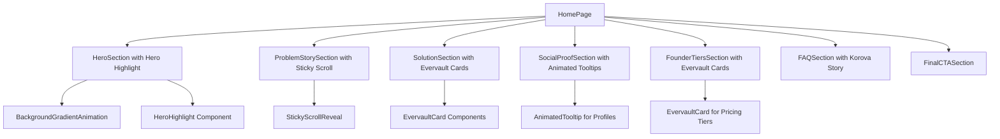
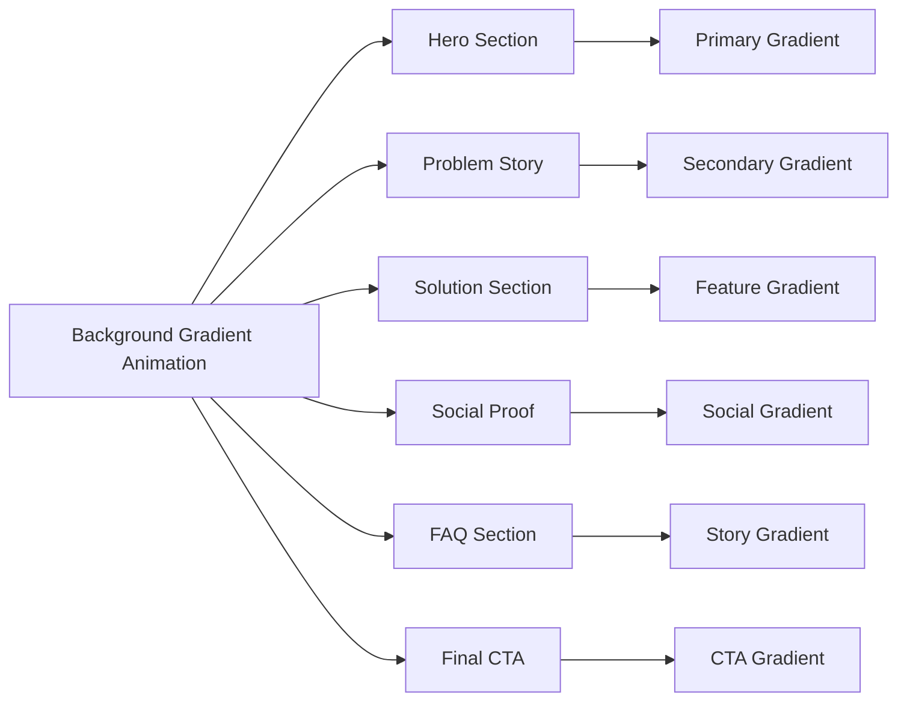

# Korova Landing Page Modernization Design

## Overview

This design document outlines the modernization of the existing landing page application, transforming it from "CineMatch" to "Korova" - a sophisticated platform inspired by the iconic milk bar from "A Clockwork Orange". The modernization incorporates cutting-edge Aceternity UI components to create a more visually appealing and interactive user experience while maintaining the core functionality of connecting film enthusiasts.

## Technology Stack & Dependencies

### Core Framework
- **Next.js 14**: React-based framework with App Router
- **TypeScript**: Type-safe development
- **Tailwind CSS**: Utility-first styling framework

### New UI Component Libraries
- **Aceternity UI Components**: Modern, animated UI primitives
  - **Evervault Card**: Interactive card with encrypted hover effects
  - **Background Gradient Animation**: Dynamic animated gradient backgrounds
  - **Sticky Scroll Reveal**: Scroll-triggered content revelations
  - **Hero Highlight**: Animated text highlighting with gradient effects
  - **Animated Tooltip**: Interactive profile tooltips with smooth animations

### Installation Commands
```bash
# Install Aceternity UI components
npx shadcn@latest add https://ui.aceternity.com/registry/evervault-card.json
npx shadcn@latest add https://ui.aceternity.com/registry/background-gradient-animation.json
npx shadcn@latest add https://ui.aceternity.com/registry/sticky-scroll-reveal.json
npx shadcn@latest add https://ui.aceternity.com/registry/hero-highlight.json
npx shadcn@latest add https://ui.aceternity.com/registry/animated-tooltip.json
```

### Animation & Visual Enhancements
- **Framer Motion**: Advanced animations (via Aceternity components)
- **Custom CSS Animations**: GPU-accelerated transforms
- **Gradient Animations**: Dynamic background effects with custom keyframes

### Required CSS Animations
```css
@keyframes moveHorizontal {
  0% { transform: translateX(-50%) translateY(-10%); }
  50% { transform: translateX(50%) translateY(10%); }
  100% { transform: translateX(-50%) translateY(-10%); }
}

@keyframes moveInCircle {
  0% { transform: rotate(0deg); }
  50% { transform: rotate(180deg); }
  100% { transform: rotate(360deg); }
}

@keyframes moveVertical {
  0% { transform: translateY(-50%); }
  50% { transform: translateY(50%); }
  100% { transform: translateY(-50%); }
}
```

## Component Architecture

### Enhanced Component Hierarchy



### New Component Integrations

#### 1. BackgroundGradientAnimation
- **Purpose**: Replace static gradient backgrounds with dynamic animated gradients
- **Implementation**: Site-wide background component
- **Features**: Smooth color transitions, performance-optimized
- **Props Configuration**:
  ```typescript
  interface BackgroundGradientProps {
    gradientBackgroundStart?: string; // "rgb(108, 0, 162)"
    gradientBackgroundEnd?: string;   // "rgb(0, 17, 82)"
    firstColor?: string;              // "18, 113, 255"
    secondColor?: string;             // "221, 74, 255"
    thirdColor?: string;              // "100, 220, 255"
    fourthColor?: string;             // "200, 50, 50"
    fifthColor?: string;              // "180, 180, 50"
    interactive?: boolean;            // true
    children: React.ReactNode;
  }
  ```

#### 2. EvervaultCard Component
- **Purpose**: Enhance card displays with encrypted-style hover effects
- **Usage Areas**:
  - Solution feature cards
  - Founder tier pricing cards
  - Testimonial cards in social proof section
- **Features**: Hover animations, encrypted text effect, modern aesthetics
- **Implementation Example**:
  ```tsx
  <div className="border border-black/[0.2] dark:border-white/[0.2] flex flex-col items-start max-w-sm mx-auto p-4 relative h-[30rem]">
    <Icon className="absolute h-6 w-6 -top-3 -left-3 dark:text-white text-black" />
    <Icon className="absolute h-6 w-6 -bottom-3 -left-3 dark:text-white text-black" />
    <Icon className="absolute h-6 w-6 -top-3 -right-3 dark:text-white text-black" />
    <Icon className="absolute h-6 w-6 -bottom-3 -right-3 dark:text-white text-black" />
    <EvervaultCard text="Korova" />
    <h2 className="dark:text-white text-black mt-4 text-sm font-light">
      Discover cinema connections
    </h2>
  </div>
  ```

#### 3. StickyScrollReveal
- **Purpose**: Create engaging scroll-based revelations
- **Implementation**: Problem story and solution sections
- **Features**: Content reveals on scroll, sticky navigation elements
- **Content Structure**:
  ```typescript
  interface StickyScrollContent {
    title: string;
    description: string;
    content: React.ReactNode;
  }
  
  const korovaContent: StickyScrollContent[] = [
    {
      title: "Cinema Connection Problem",
      description: "Traditional dating apps focus on superficial matches...",
      content: (
        <div className="flex h-full w-full items-center justify-center bg-[linear-gradient(to_bottom_right,var(--cyan-500),var(--emerald-500))] text-white">
          Connection Problem
        </div>
      )
    }
  ];
  ```

#### 4. HeroHighlight
- **Purpose**: Emphasize key text in hero section
- **Implementation**: Highlight important phrases in headlines
- **Features**: Animated text highlighting, gradient effects
- **Usage Example**:
  ```tsx
  <HeroHighlight>
    <motion.h1
      initial={{ opacity: 0, y: 20 }}
      animate={{ opacity: 1, y: [20, -5, 0] }}
      transition={{ duration: 0.5, ease: [0.4, 0.0, 0.2, 1] }}
      className="text-2xl px-4 md:text-4xl lg:text-5xl font-bold text-neutral-700 dark:text-white max-w-4xl leading-relaxed lg:leading-snug text-center mx-auto"
    >
      Discover Your Tribe in the{" "}
      <Highlight className="text-black dark:text-white">
        Korova
      </Highlight>
      {" "}Where Cinema Meets Connection
    </motion.h1>
  </HeroHighlight>
  ```

#### 5. AnimatedTooltip
- **Purpose**: Enhanced user profile displays
- **Implementation**: Social proof section user avatars
- **Features**: Smooth hover animations, profile information display
- **Data Structure**:
  ```typescript
  interface TooltipPerson {
    id: number;
    name: string;
    designation: string;
    image: string;
  }
  
  const korovaUsers: TooltipPerson[] = [
    {
      id: 1,
      name: "Sarah Chen",
      designation: "Film Student",
      image: "https://images.unsplash.com/photo-1..."
    }
  ];
  
  // Usage
  <AnimatedTooltip items={korovaUsers} />
  ```

## Rebranding: CineMatch → Korova

### Brand Identity Transformation

#### Name Change Rationale
- **Korova**: Reference to the Korova Milk Bar from "A Clockwork Orange"
- **Connection**: Maintains film culture theme while adding sophistication
- **Positioning**: Elevated cultural reference appealing to cinephiles

#### Visual Identity Updates
- **Logo**: Film reel icon replaced with milk glass or abstract K symbol
- **Color Scheme**: Maintain current primary colors but add milk-white accents
- **Typography**: Keep existing hierarchy, update brand name styling

### Content Updates

#### Hero Section
- **Old**: "Find Your People Through The Films You Love"
- **New**: "Discover Your Tribe in the Korova - Where Cinema Meets Connection"
- **Tagline**: "Like the famous milk bar, Korova is where culture and conversation flow"

#### FAQ Section Enhancement
- **New FAQ Item**: "Why is it called Korova?"
- **Answer**: "Korova takes its name from the iconic Korova Milk Bar in Stanley Kubrick's 'A Clockwork Orange'. Just as the milk bar was a gathering place for the film's characters, our platform brings together cinema enthusiasts in a space where meaningful connections are formed over shared film experiences. It represents sophistication, cultural appreciation, and the transformative power of cinema."

## Enhanced User Experience Features

### 1. Dynamic Background System


### 2. Enhanced Card Interactions
- **Evervault Effect**: Cards display encrypted-style text that reveals on hover
- **Animation Timing**: Staggered animations for multiple cards
- **Performance**: GPU-accelerated transforms

### 3. Sticky Scroll Navigation
- **Problem Story Section**: Multi-panel sticky scroll experience
- **Solution Features**: Progressive revelation of features
- **User Journey**: Enhanced storytelling through scroll interactions

### 4. Profile Display Enhancement
- **Animated Tooltips**: Replace static profile images with interactive tooltips
- **User Information**: Display additional context on hover
- **Social Proof**: Enhanced credibility through detailed user profiles

## Implementation Strategy

### Phase 1: Foundation Setup
1. **Install Aceternity UI Dependencies**
   ```bash
   # Install all required Aceternity components
   npx shadcn@latest add https://ui.aceternity.com/registry/evervault-card.json
   npx shadcn@latest add https://ui.aceternity.com/registry/background-gradient-animation.json
   npx shadcn@latest add https://ui.aceternity.com/registry/sticky-scroll-reveal.json
   npx shadcn@latest add https://ui.aceternity.com/registry/hero-highlight.json
   npx shadcn@latest add https://ui.aceternity.com/registry/animated-tooltip.json
   
   # Install motion dependency if not present
   npm install motion
   ```

2. **CSS Animation Setup**
   - Add required keyframe animations to global CSS
   - Configure Tailwind animation classes
   - Set up custom animation variables

3. **Background System Implementation**
   - Implement BackgroundGradientAnimation wrapper
   - Configure gradient color schemes for different sections
   - Test performance across devices

### Phase 2: Component Integration
1. **Hero Section Modernization**
   ```tsx
   // Updated hero with HeroHighlight and BackgroundGradientAnimation
   <BackgroundGradientAnimation>
     <section className="relative min-h-screen flex items-center justify-center">
       <HeroHighlight>
         <motion.h1 className="text-2xl px-4 md:text-4xl lg:text-5xl font-bold max-w-4xl leading-relaxed text-center mx-auto">
           Discover Your Tribe in the{" "}
           <Highlight className="text-black dark:text-white">
             Korova
           </Highlight>
           {" "}Where Cinema Meets Connection
         </motion.h1>
       </HeroHighlight>
     </section>
   </BackgroundGradientAnimation>
   ```

2. **Card System Upgrade**
   ```tsx
   // Replace existing cards with EvervaultCard
   {korovaFeatureCards.map((card) => (
     <div key={card.id} className="border border-black/[0.2] dark:border-white/[0.2] flex flex-col items-start max-w-sm mx-auto p-4 relative h-[30rem]">
       <Icon className="absolute h-6 w-6 -top-3 -left-3 dark:text-white text-black" />
       <Icon className="absolute h-6 w-6 -bottom-3 -right-3 dark:text-white text-black" />
       <EvervaultCard text={card.hoverText} />
       <h2 className="dark:text-white text-black mt-4 text-sm font-light">
         {card.description}
       </h2>
     </div>
   ))}
   ```

### Phase 3: Interactive Enhancements
1. **Scroll Experience Implementation**
   ```tsx
   // Implement StickyScrollReveal for story sections
   <section className="w-full py-4">
     <StickyScroll content={korovaStoryContent} />
   </section>
   ```

2. **Profile System Enhancement**
   ```tsx
   // Replace static avatars with AnimatedTooltip
   <div className="flex flex-row items-center justify-center mb-10 w-full">
     <AnimatedTooltip items={korovaCommunity} />
   </div>
   ```

### Phase 4: Content & Branding
1. **Rebranding Implementation**
   - Update all references from CineMatch to Korova
   - Implement new visual identity with Korova styling
   - Update FAQ with Clockwork Orange story reference

2. **Content Optimization**
   ```tsx
   // Updated FAQ with Korova backstory
   const korovaFAQ = [
     {
       question: "Why is it called Korova?",
       answer: "Korova takes its name from the iconic Korova Milk Bar in Stanley Kubrick's 'A Clockwork Orange'. Just as the milk bar was a gathering place for the film's characters, our platform brings together cinema enthusiasts in a space where meaningful connections are formed over shared film experiences. It represents sophistication, cultural appreciation, and the transformative power of cinema."
     },
     // ... other FAQ items
   ];
   ```

## Data Models & Content Structure

### Enhanced User Profile Model
```typescript
// Updated to match AnimatedTooltip requirements
interface KorovaUserProfile {
  id: number;
  name: string;
  designation: string;
  image: string;
  // Extended properties for enhanced profiles
  favoriteFilms?: string[];
  cinemaPreferences?: string[];
  location?: string;
  joinedDate?: Date;
  testimonial?: string;
  rating?: number;
}

// Example Korova community members
const korovaCommunity: KorovaUserProfile[] = [
  {
    id: 1,
    name: "Sarah Chen",
    designation: "Film Student & Kurosawa Enthusiast",
    image: "https://images.unsplash.com/photo-1...",
    favoriteFilms: ["Seven Samurai", "Mulholland Drive"],
    testimonial: "Finally, an app that gets it! Can't wait to find my fellow Kurosawa enthusiasts."
  },
  {
    id: 2,
    name: "Marcus Williams",
    designation: "Arthouse Cinema Blogger",
    image: "https://images.unsplash.com/photo-1...",
    favoriteFilms: ["8½", "Persona", "The Tree of Life"],
    testimonial: "Tired of explaining why I love arthouse films to people who don't understand."
  },
  {
    id: 3,
    name: "Emma Rodriguez",
    designation: "Cinema Manager & Kubrick Scholar",
    image: "https://images.unsplash.com/photo-1...",
    favoriteFilms: ["2001: A Space Odyssey", "A Clockwork Orange"],
    testimonial: "I see how movies bring people together every day. Korova will be a game-changer."
  }
];
```

### Evervault Card Content Model
```typescript
// Content structure for EvervaultCard components
interface EvervaultCardContent {
  id: string;
  title: string;
  description: string;
  features: string[];
  hoverText: string; // Text shown in the encrypted effect
  ctaText?: string;
  ctaLink?: string;
  iconPositions?: {
    topLeft?: boolean;
    topRight?: boolean;
    bottomLeft?: boolean;
    bottomRight?: boolean;
  };
}

// Example card content for Korova features
const korovaFeatureCards: EvervaultCardContent[] = [
  {
    id: "cinema-dna",
    title: "Cinema DNA Matching",
    description: "Our algorithm analyzes your film preferences to create unique compatibility scores",
    features: ["Genre Analysis", "Director Preferences", "Mood Matching"],
    hoverText: "DNA",
    ctaText: "Learn More"
  },
  {
    id: "cultural-connections",
    title: "Cultural Connections", 
    description: "Connect with fellow cinephiles who appreciate sophisticated storytelling",
    features: ["Arthouse Enthusiasts", "Festival Goers", "Film Students"],
    hoverText: "CULTURE",
    ctaText: "Join Community"
  }
];
```

### Sticky Scroll Content Model
```typescript
// Content structure for StickyScrollReveal
interface StickyScrollSection {
  title: string;
  description: string;
  content: React.ReactNode;
}

// Korova story content for sticky scroll
const korovaStoryContent: StickyScrollSection[] = [
  {
    title: "The Problem with Surface Connections",
    description: "Traditional dating apps focus on photos and basic interests, missing the depth that true cinema appreciation brings to relationships. Meaningful connections require shared cultural understanding.",
    content: (
      <div className="flex h-full w-full items-center justify-center bg-[linear-gradient(to_bottom_right,var(--cyan-500),var(--emerald-500))] text-white">
        Surface Connections
      </div>
    )
  },
  {
    title: "Cinema as Cultural Language",
    description: "Film preferences reveal personality, values, and emotional depth. Someone who loves Tarkovsky speaks a different cultural language than someone who only watches blockbusters.",
    content: (
      <div className="flex h-full w-full items-center justify-center text-white">
        
      </div>
    )
  },
  {
    title: "The Korova Solution",
    description: "Like the sophisticated gathering place in Kubrick's masterpiece, Korova creates a space where cultural appreciation and meaningful connection intersect.",
    content: (
      <div className="flex h-full w-full items-center justify-center bg-[linear-gradient(to_bottom_right,var(--orange-500),var(--yellow-500))] text-white">
        Korova Connection
      </div>
    )
  }
];
```

## Animation Implementation Strategy

### Performance Optimization
- **GPU Acceleration**: Use transform and opacity for animations
- **Intersection Observer**: Trigger animations on scroll
- **Reduced Motion**: Respect user accessibility preferences
- **Lazy Loading**: Load animation components on demand

### Animation Hierarchy
1. **Entrance Animations**: Staggered FadeIn components
2. **Scroll Animations**: StickyScrollReveal interactions
3. **Hover Animations**: EvervaultCard and AnimatedTooltip effects
4. **Background Animations**: Continuous gradient movements

## Testing Strategy

### Component Testing
- **Unit Tests**: Individual Aceternity component integration
- **Visual Regression**: Screenshot testing for animations
- **Performance Tests**: Animation frame rate monitoring
- **Accessibility Tests**: Screen reader compatibility

### User Experience Testing
- **Scroll Performance**: Smooth scrolling across devices
- **Animation Quality**: 60fps animation targets
- **Loading Performance**: Component lazy loading verification
- **Mobile Responsiveness**: Touch interaction optimization

### Cross-Browser Compatibility
- **Modern Browsers**: Chrome, Firefox, Safari, Edge
- **Animation Fallbacks**: Graceful degradation for older browsers
- **Performance Monitoring**: Real-time performance metrics

## SEO & Metadata Updates

### Brand-Focused SEO
- **Title Updates**: "Korova - Where Cinema Meets Connection"
- **Meta Descriptions**: Cultural sophistication messaging
- **Keywords**: Film culture, cinema community, sophisticated connections
- **Schema Markup**: Cultural platform structured data

### Content Optimization
- **Cultural References**: A Clockwork Orange connections
- **Film Industry Terms**: Elevated vocabulary
- **Community Focus**: Cultural gathering place messaging