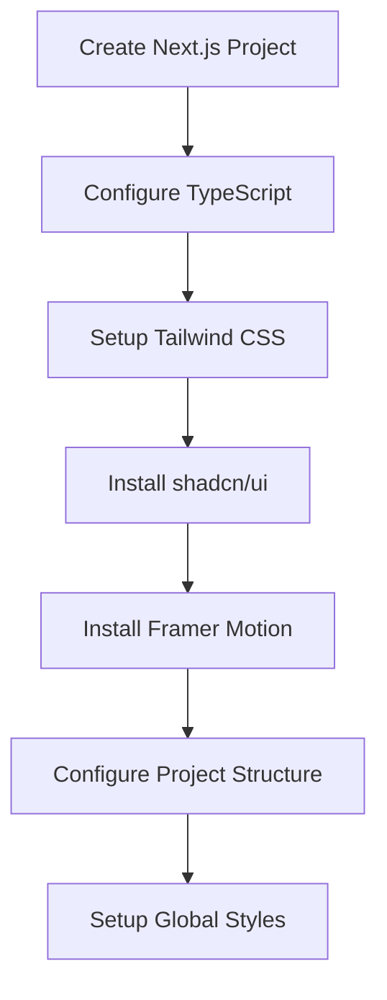

# Next.js + shadcn/ui + Framer Motion Setup Design

## Overview

This document outlines the technical setup and architecture for creating a CineMatch pre-launch landing page using Next.js as the framework, shadcn/ui for UI components, and Framer Motion for animations. The project will be optimized for performance, SEO, and conversion rate optimization.

## Technology Stack & Dependencies

### Core Framework
- **Next.js 14** - React framework with App Router for optimal performance and SEO
- **TypeScript** - Type safety and better developer experience
- **Tailwind CSS** - Utility-first CSS framework for rapid styling

### UI & Animation Libraries
- **shadcn/ui** - Accessible, composable UI components built on Radix UI
- **Framer Motion** - Production-ready motion library for React
- **Lucide React** - Beautiful & consistent icons

### Additional Dependencies
- **Class Variance Authority (CVA)** - For component variant management
- **clsx** - Utility for constructing className strings conditionally
- **tailwind-merge** - Merge Tailwind CSS classes without conflicts

## Project Structure & Architecture

```
landing-page/
├── app/
│   ├── globals.css
│   ├── layout.tsx
│   ├── page.tsx
│   └── favicon.ico
├── components/
│   ├── ui/
│   │   ├── button.tsx
│   │   ├── input.tsx
│   │   ├── card.tsx
│   │   ├── accordion.tsx
│   │   └── index.ts
│   ├── sections/
│   │   ├── hero.tsx
│   │   ├── problem-story.tsx
│   │   ├── solution.tsx
│   │   ├── social-proof.tsx
│   │   ├── founder-tiers.tsx
│   │   ├── faq.tsx
│   │   └── final-cta.tsx
│   ├── layout/
│   │   ├── header.tsx
│   │   └── footer.tsx
│   └── animations/
│       ├── fade-in.tsx
│       ├── scroll-reveal.tsx
│       └── floating-element.tsx
├── lib/
│   └── utils.ts
├── public/
│   ├── images/
│   └── icons/
├── styles/
│   └── globals.css
├── package.json
├── tailwind.config.js
├── components.json
└── next.config.js
```

## Setup & Installation Process

### 1. Next.js Project Initialization



#### Project Creation Commands
```bash
# Create Next.js project with TypeScript and Tailwind
npx create-next-app@latest landing-page --typescript --tailwind --app

# Navigate to project directory
cd landing-page

# Install additional dependencies
npm install framer-motion lucide-react class-variance-authority clsx tailwind-merge
```

### 2. shadcn/ui Configuration

#### Initialize shadcn/ui
```bash
npx shadcn-ui@latest init
```

#### shadcn/ui Configuration Options
| Setting | Value | Reason |
|---------|-------|---------|
| Style | Default | Clean, professional appearance |
| Base Color | Slate | Matches cinematic dark theme |
| CSS Variables | Yes | Better theming flexibility |

#### Component Installation
```bash
# Install required UI components
npx shadcn-ui@latest add button
npx shadcn-ui@latest add input
npx shadcn-ui@latest add card
npx shadcn-ui@latest add accordion
npx shadcn-ui@latest add badge
```

### 3. Framer Motion Integration

#### Animation Component Architecture
```typescript
// animations/fade-in.tsx
interface FadeInProps {
  children: React.ReactNode;
  delay?: number;
  direction?: 'up' | 'down' | 'left' | 'right';
}

// animations/scroll-reveal.tsx
interface ScrollRevealProps {
  children: React.ReactNode;
  threshold?: number;
  once?: boolean;
}
```

## Component Architecture

### Core UI Components

#### Button Component Enhancement
```typescript
// components/ui/button.tsx (Enhanced)
const buttonVariants = cva(
  "inline-flex items-center justify-center rounded-md transition-colors",
  {
    variants: {
      variant: {
        default: "bg-primary text-primary-foreground hover:bg-primary/90",
        cta: "bg-accent text-accent-foreground hover:bg-accent/90 shadow-lg",
        ghost: "hover:bg-accent hover:text-accent-foreground",
      },
      size: {
        default: "h-10 px-4 py-2",
        lg: "h-12 px-8 py-3 text-lg",
        sm: "h-8 px-3 text-sm",
      }
    }
  }
)
```

#### Input Component for Email Collection
```typescript
// components/ui/input.tsx (Email optimized)
interface EmailInputProps {
  placeholder?: string;
  onSubmit: (email: string) => void;
  buttonText?: string;
}
```

### Layout Components

#### Sticky Header Component
```typescript
// components/layout/header.tsx
interface HeaderProps {
  transparent?: boolean;
  showFounderCTA?: boolean;
}

// Features:
// - Scroll-triggered background blur
// - Logo positioning
// - Responsive navigation
// - Founder CTA integration
```

### Section Components Architecture

#### Hero Section
```typescript
// components/sections/hero.tsx
interface HeroSectionProps {
  headline: string;
  subHeadline: string;
  ctaText: string;
  onEmailSubmit: (email: string) => void;
}

// Features:
// - 3D model integration placeholder
// - Animated text reveals
// - Email capture form
// - Background gradient effects
```

#### Problem Story Section
```typescript
// components/sections/problem-story.tsx
interface ProblemCard {
  persona: 'alex' | 'ben' | 'chloe';
  title: string;
  description: string;
  icon: string;
}

// Features:
// - Three-column responsive layout
// - Card hover animations
// - Icon integration
// - Scroll-triggered reveals
```

## Styling Strategy

### Tailwind Configuration

#### Custom Color Palette
```javascript
// tailwind.config.js
module.exports = {
  theme: {
    extend: {
      colors: {
        background: '#121212',
        foreground: '#FAFAFA',
        primary: '#FFC107',
        secondary: '#00A9A5',
        accent: '#FFC107',
        muted: '#404040',
      },
      animation: {
        'fade-in': 'fadeIn 0.6s ease-in-out',
        'slide-up': 'slideUp 0.8s ease-out',
        'float': 'float 3s ease-in-out infinite',
      }
    }
  }
}
```

#### Typography Scale
```css
/* globals.css */
.heading-xl { @apply text-4xl md:text-6xl font-bold leading-tight; }
.heading-lg { @apply text-3xl md:text-4xl font-semibold; }
.heading-md { @apply text-2xl md:text-3xl font-medium; }
.body-lg { @apply text-lg md:text-xl leading-relaxed; }
.body-md { @apply text-base md:text-lg; }
```

### Component Styling Patterns

#### Card Component Variants
```typescript
const cardVariants = cva(
  "rounded-lg border bg-card text-card-foreground shadow-sm",
  {
    variants: {
      variant: {
        default: "border-border",
        elevated: "shadow-lg border-transparent",
        pricing: "border-primary shadow-xl relative overflow-hidden",
      }
    }
  }
)
```

## Animation Strategy

### Motion Presets

#### Scroll-Based Animations
```typescript
// Animation configurations
export const fadeInUp = {
  initial: { opacity: 0, y: 60 },
  animate: { opacity: 1, y: 0 },
  transition: { duration: 0.6, ease: "easeOut" }
};

export const staggerChildren = {
  animate: {
    transition: {
      staggerChildren: 0.1
    }
  }
};
```

#### Interactive Animations
```typescript
// Button hover animations
export const buttonHover = {
  whileHover: { scale: 1.02 },
  whileTap: { scale: 0.98 },
  transition: { type: "spring", stiffness: 400, damping: 10 }
};

// Card animations
export const cardHover = {
  whileHover: { y: -5, boxShadow: "0 10px 25px rgba(0,0,0,0.15)" },
  transition: { duration: 0.2 }
};
```

### Performance Optimization

#### Framer Motion Best Practices
- Use `transform` properties for animations (translateX, translateY, scale)
- Implement `will-change` CSS property for animated elements
- Utilize `layoutId` for shared element transitions
- Apply `initial={false}` for server-side rendering compatibility

## Routing & Navigation

### App Router Structure
```typescript
// app/layout.tsx
export default function RootLayout({
  children,
}: {
  children: React.ReactNode
}) {
  return (
    <html lang="en">
      <body className="min-h-screen bg-background text-foreground">
        <Header />
        {children}
        <Footer />
      </body>
    </html>
  )
}
```

### Page Component Architecture
```typescript
// app/page.tsx
export default function HomePage() {
  return (
    <main>
      <HeroSection />
      <ProblemStorySection />
      <SolutionSection />
      <SocialProofSection />
      <FounderTiersSection />
      <FAQSection />
      <FinalCTASection />
    </main>
  )
}
```

## State Management

### Email Collection State
```typescript
// hooks/useEmailCollection.ts
interface EmailState {
  email: string;
  isSubmitting: boolean;
  isSubmitted: boolean;
  error: string | null;
}

export function useEmailCollection() {
  const [state, setState] = useState<EmailState>({
    email: '',
    isSubmitting: false,
    isSubmitted: false,
    error: null
  });
  
  const submitEmail = async (email: string) => {
    // Email submission logic
  };
  
  return { state, submitEmail };
}
```

### Founder Tier Selection
```typescript
// hooks/useFounderTiers.ts
interface FounderTier {
  id: string;
  name: string;
  price: number;
  features: string[];
  popular?: boolean;
}

export function useFounderTiers() {
  const [selectedTier, setSelectedTier] = useState<string | null>(null);
  
  const selectTier = (tierId: string) => {
    setSelectedTier(tierId);
    // Analytics tracking
  };
  
  return { selectedTier, selectTier };
}
```

## API Integration Layer

### Email Submission Service
```typescript
// lib/api/email.ts
export async function submitToWaitlist(email: string) {
  const response = await fetch('/api/waitlist', {
    method: 'POST',
    headers: {
      'Content-Type': 'application/json',
    },
    body: JSON.stringify({ email }),
  });
  
  if (!response.ok) {
    throw new Error('Failed to submit email');
  }
  
  return response.json();
}
```

### Payment Integration
```typescript
// lib/api/payment.ts
export async function createPaymentSession(tierId: string) {
  const response = await fetch('/api/payment', {
    method: 'POST',
    headers: {
      'Content-Type': 'application/json',
    },
    body: JSON.stringify({ tierId }),
  });
  
  return response.json();
}
```

## Testing Strategy

### Component Testing Structure
```typescript
// __tests__/components/hero.test.tsx
import { render, screen } from '@testing-library/react';
import { HeroSection } from '@/components/sections/hero';

describe('HeroSection', () => {
  it('renders headline and CTA button', () => {
    render(<HeroSection />);
    expect(screen.getByRole('heading', { level: 1 })).toBeInTheDocument();
    expect(screen.getByRole('button', { name: /join the waitlist/i })).toBeInTheDocument();
  });
});
```

### Animation Testing
```typescript
// __tests__/animations/fade-in.test.tsx
import { render } from '@testing-library/react';
import { FadeIn } from '@/components/animations/fade-in';

describe('FadeIn Animation', () => {
  it('applies correct initial and animate states', () => {
    const { container } = render(
      <FadeIn>
        <div data-testid="animated-content">Content</div>
      </FadeIn>
    );
    
    // Test animation properties
  });
});
```

### Performance Testing
- Lighthouse CI integration for performance monitoring
- Bundle size analysis with @next/bundle-analyzer
- Core Web Vitals tracking implementation

## Development Workflow

### File Creation Order
1. Setup base Next.js project structure
2. Configure Tailwind and shadcn/ui
3. Create layout components (Header, Footer)
4. Build UI component library
5. Implement animation components
6. Create section components
7. Integrate state management
8. Add API integration
9. Implement testing suite

### Code Organization Standards
- Use barrel exports for component modules
- Implement consistent naming conventions
- Apply TypeScript strict mode
- Follow React best practices for component composition
- Maintain separation of concerns between UI and business logic

## Configuration Files

### Next.js Configuration
```javascript
// next.config.js
/** @type {import('next').NextConfig} */
const nextConfig = {
  experimental: {
    appDir: true,
  },
  images: {
    domains: ['images.unsplash.com'],
    formats: ['image/webp', 'image/avif'],
  },
  compiler: {
    removeConsole: process.env.NODE_ENV === 'production',
  },
  async headers() {
    return [
      {
        source: '/(.*)',
        headers: [
          {
            key: 'X-Frame-Options',
            value: 'DENY',
          },
          {
            key: 'X-Content-Type-Options',
            value: 'nosniff',
          },
        ],
      },
    ];
  },
};

module.exports = nextConfig;
```

### TypeScript Configuration
```json
// tsconfig.json
{
  "compilerOptions": {
    "target": "es5",
    "lib": ["dom", "dom.iterable", "es6"],
    "allowJs": true,
    "skipLibCheck": true,
    "strict": true,
    "noEmit": true,
    "esModuleInterop": true,
    "module": "esnext",
    "moduleResolution": "bundler",
    "resolveJsonModule": true,
    "isolatedModules": true,
    "jsx": "preserve",
    "incremental": true,
    "plugins": [
      {
        "name": "next"
      }
    ],
    "baseUrl": ".",
    "paths": {
      "@/*": ["./*"],
      "@/components/*": ["./components/*"],
      "@/lib/*": ["./lib/*"],
      "@/hooks/*": ["./hooks/*"]
    }
  },
  "include": ["next-env.d.ts", "**/*.ts", "**/*.tsx", ".next/types/**/*.ts"],
  "exclude": ["node_modules"]
}
```

### shadcn/ui Configuration
```json
// components.json
{
  "$schema": "https://ui.shadcn.com/schema.json",
  "style": "default",
  "rsc": true,
  "tsx": true,
  "tailwind": {
    "config": "tailwind.config.js",
    "css": "app/globals.css",
    "baseColor": "slate",
    "cssVariables": true
  },
  "aliases": {
    "components": "@/components",
    "utils": "@/lib/utils"
  }
}
```

## Performance Optimization

### Image Optimization Strategy
```typescript
// components/ui/optimized-image.tsx
import Image from 'next/image';
import { cn } from '@/lib/utils';

interface OptimizedImageProps {
  src: string;
  alt: string;
  width: number;
  height: number;
  priority?: boolean;
  className?: string;
  placeholder?: 'blur' | 'empty';
  blurDataURL?: string;
}

export function OptimizedImage({
  src,
  alt,
  width,
  height,
  priority = false,
  className,
  placeholder = 'empty',
  blurDataURL,
}: OptimizedImageProps) {
  return (
    <Image
      src={src}
      alt={alt}
      width={width}
      height={height}
      priority={priority}
      placeholder={placeholder}
      blurDataURL={blurDataURL}
      className={cn('object-cover', className)}
      sizes="(max-width: 768px) 100vw, (max-width: 1200px) 50vw, 33vw"
    />
  );
}
```

### Lazy Loading Components
```typescript
// components/lazy/lazy-section.tsx
import { lazy, Suspense } from 'react';
import { motion } from 'framer-motion';

// Lazy load heavy sections
const FounderTiersSection = lazy(() => import('@/components/sections/founder-tiers'));
const SocialProofSection = lazy(() => import('@/components/sections/social-proof'));

interface LazySectionProps {
  children: React.ReactNode;
  fallback?: React.ReactNode;
}

export function LazySection({ children, fallback }: LazySectionProps) {
  return (
    <Suspense fallback={fallback || <div className="h-96 animate-pulse bg-muted" />}>
      {children}
    </Suspense>
  );
}
```

## SEO & Meta Configuration

### Dynamic Metadata Generation
```typescript
// app/layout.tsx
import type { Metadata } from 'next';

export const metadata: Metadata = {
  title: 'CineMatch | Find Your People Through The Films You Love',
  description: 'Tired of superficial connections? CineMatch connects you with friends and partners based on your unique movie taste. Join the waitlist for exclusive early access.',
  keywords: ['movie matching', 'film lovers', 'cinematic connections', 'movie app', 'film community'],
  authors: [{ name: 'CineMatch Team' }],
  creator: 'CineMatch',
  openGraph: {
    type: 'website',
    locale: 'en_US',
    url: 'https://cinematch.app',
    title: 'CineMatch | Find Your People Through The Films You Love',
    description: 'Connect with people who share your unique movie taste.',
    siteName: 'CineMatch',
    images: [
      {
        url: '/og-image.jpg',
        width: 1200,
        height: 630,
        alt: 'CineMatch - Find Your People Through Films',
      },
    ],
  },
  twitter: {
    card: 'summary_large_image',
    title: 'CineMatch | Find Your People Through The Films You Love',
    description: 'Connect with people who share your unique movie taste.',
    images: ['/og-image.jpg'],
    creator: '@cinematch_app',
  },
  robots: {
    index: true,
    follow: true,
    googleBot: {
      index: true,
      follow: true,
      'max-video-preview': -1,
      'max-image-preview': 'large',
      'max-snippet': -1,
    },
  },
};
```

### Structured Data Implementation
```typescript
// components/seo/structured-data.tsx
interface StructuredDataProps {
  type: 'WebSite' | 'Organization' | 'Product';
  data: Record<string, any>;
}

export function StructuredData({ type, data }: StructuredDataProps) {
  const structuredData = {
    '@context': 'https://schema.org',
    '@type': type,
    ...data,
  };

  return (
    <script
      type="application/ld+json"
      dangerouslySetInnerHTML={{
        __html: JSON.stringify(structuredData),
      }}
    />
  );
}
```

## Analytics & Tracking Integration

### Custom Analytics Hook
```typescript
// hooks/useAnalytics.ts
import { useCallback } from 'react';

interface AnalyticsEvent {
  action: string;
  category: string;
  label?: string;
  value?: number;
}

export function useAnalytics() {
  const trackEvent = useCallback((event: AnalyticsEvent) => {
    // Plausible Analytics
    if (typeof window !== 'undefined' && window.plausible) {
      window.plausible(event.action, {
        props: {
          category: event.category,
          label: event.label,
          value: event.value,
        },
      });
    }

    // Google Analytics 4
    if (typeof window !== 'undefined' && window.gtag) {
      window.gtag('event', event.action, {
        event_category: event.category,
        event_label: event.label,
        value: event.value,
      });
    }
  }, []);

  const trackWaitlistSignup = useCallback((email: string) => {
    trackEvent({
      action: 'waitlist_signup',
      category: 'conversion',
      label: 'email_capture',
    });
  }, [trackEvent]);

  const trackFounderTierSelection = useCallback((tier: string, price: number) => {
    trackEvent({
      action: 'founder_tier_selected',
      category: 'conversion',
      label: tier,
      value: price,
    });
  }, [trackEvent]);

  return {
    trackEvent,
    trackWaitlistSignup,
    trackFounderTierSelection,
  };
}
```

### A/B Testing Framework
```typescript
// lib/ab-testing.ts
interface ABTest {
  id: string;
  variants: string[];
  weights?: number[];
}

export class ABTestManager {
  private tests: Map<string, ABTest> = new Map();

  registerTest(test: ABTest) {
    this.tests.set(test.id, test);
  }

  getVariant(testId: string, userId?: string): string {
    const test = this.tests.get(testId);
    if (!test) return test?.variants[0] || 'control';

    // Simple hash-based assignment
    const hash = this.hashString(userId || 'anonymous');
    const index = hash % test.variants.length;
    return test.variants[index];
  }

  private hashString(str: string): number {
    let hash = 0;
    for (let i = 0; i < str.length; i++) {
      const char = str.charCodeAt(i);
      hash = ((hash << 5) - hash) + char;
      hash = hash & hash; // Convert to 32-bit integer
    }
    return Math.abs(hash);
  }
}

// Usage in components
export function useABTest(testId: string) {
  const [variant, setVariant] = useState<string>('control');

  useEffect(() => {
    const abTestManager = new ABTestManager();
    abTestManager.registerTest({
      id: 'hero_headline',
      variants: ['original', 'emotional', 'benefit_focused'],
    });

    const userVariant = abTestManager.getVariant(testId);
    setVariant(userVariant);
  }, [testId]);

  return variant;
}
```

## Form Validation & Error Handling

### Email Validation Schema
```typescript
// lib/validation.ts
import { z } from 'zod';

export const emailSchema = z.object({
  email: z
    .string()
    .email('Please enter a valid email address')
    .min(1, 'Email is required')
    .max(100, 'Email is too long'),
});

export const founderTierSchema = z.object({
  tierId: z.string().min(1, 'Please select a tier'),
  email: z.string().email('Please enter a valid email address'),
  name: z.string().min(2, 'Name must be at least 2 characters'),
});

export type EmailFormData = z.infer<typeof emailSchema>;
export type FounderTierFormData = z.infer<typeof founderTierSchema>;
```

### Error Boundary Component
```typescript
// components/error-boundary.tsx
import React from 'react';

interface ErrorBoundaryState {
  hasError: boolean;
  error?: Error;
}

class ErrorBoundary extends React.Component<
  React.PropsWithChildren<{}>,
  ErrorBoundaryState
> {
  constructor(props: React.PropsWithChildren<{}>) {
    super(props);
    this.state = { hasError: false };
  }

  static getDerivedStateFromError(error: Error): ErrorBoundaryState {
    return { hasError: true, error };
  }

  componentDidCatch(error: Error, errorInfo: React.ErrorInfo) {
    console.error('ErrorBoundary caught an error:', error, errorInfo);
    // Log to error tracking service
  }

  render() {
    if (this.state.hasError) {
      return (
        <div className="flex min-h-screen items-center justify-center">
          <div className="text-center">
            <h2 className="text-2xl font-bold mb-4">Something went wrong</h2>
            <p className="text-muted-foreground mb-4">
              We're sorry, but something unexpected happened.
            </p>
            <button
              onClick={() => window.location.reload()}
              className="bg-primary text-primary-foreground px-4 py-2 rounded"
            >
              Reload Page
            </button>
          </div>
        </div>
      );
    }

    return this.props.children;
  }
}

export default ErrorBoundary;
```

## Security Implementation

### Content Security Policy
```javascript
// next.config.js (CSP addition)
const ContentSecurityPolicy = `
  default-src 'self';
  script-src 'self' 'unsafe-eval' 'unsafe-inline' *.vercel-insights.com *.plausible.io;
  style-src 'self' 'unsafe-inline';
  img-src * blob: data:;
  media-src 'none';
  connect-src *;
  font-src 'self';
`;

const securityHeaders = [
  {
    key: 'Content-Security-Policy',
    value: ContentSecurityPolicy.replace(/\n/g, ''),
  },
  {
    key: 'Referrer-Policy',
    value: 'origin-when-cross-origin',
  },
  {
    key: 'X-Frame-Options',
    value: 'DENY',
  },
  {
    key: 'X-Content-Type-Options',
    value: 'nosniff',
  },
  {
    key: 'X-DNS-Prefetch-Control',
    value: 'false',
  },
  {
    key: 'Strict-Transport-Security',
    value: 'max-age=31536000; includeSubDomains; preload',
  },
  {
    key: 'Permissions-Policy',
    value: 'camera=(), microphone=(), geolocation=()',
  },
];
```

### Rate Limiting Implementation
```typescript
// lib/rate-limit.ts
import { LRUCache } from 'lru-cache';

type Options = {
  uniqueTokenPerInterval?: number;
  interval?: number;
};

export default function rateLimit(options?: Options) {
  const tokenCache = new LRUCache({
    max: options?.uniqueTokenPerInterval || 500,
    ttl: options?.interval || 60000,
  });

  return {
    check: (token: string, limit: number) =>
      new Promise<void>((resolve, reject) => {
        const tokenCount = (tokenCache.get(token) as number[]) || [0];
        if (tokenCount[0] === 0) {
          tokenCache.set(token, tokenCount);
        }
        tokenCount[0] += 1;

        const currentUsage = tokenCount[0];
        const isRateLimited = currentUsage >= limit;

        return isRateLimited ? reject() : resolve();
      }),
  };
}
```

## Deployment Configuration

### Vercel Deployment Settings
```json
// vercel.json
{
  "buildCommand": "npm run build",
  "devCommand": "npm run dev",
  "installCommand": "npm install",
  "framework": "nextjs",
  "regions": ["iad1"],
  "env": {
    "NEXT_PUBLIC_SITE_URL": "https://cinematch.app",
    "NEXT_PUBLIC_PLAUSIBLE_DOMAIN": "cinematch.app"
  },
  "headers": [
    {
      "source": "/api/(.*)",
      "headers": [
        {
          "key": "Cache-Control",
          "value": "s-maxage=60, stale-while-revalidate"
        }
      ]
    }
  ],
  "redirects": [
    {
      "source": "/home",
      "destination": "/",
      "permanent": true
    }
  ]
}
```

### Environment Variables Structure
```bash
# .env.local
NEXT_PUBLIC_SITE_URL=http://localhost:3000
NEXT_PUBLIC_PLAUSIBLE_DOMAIN=localhost
NEXT_PUBLIC_GA_MEASUREMENT_ID=G-XXXXXXXXXX

# API Keys (Server-side only)
STRIPE_SECRET_KEY=sk_test_...
EMAIL_SERVICE_API_KEY=...
DATABASE_URL=...

# .env.production
NEXT_PUBLIC_SITE_URL=https://cinematch.app
NEXT_PUBLIC_PLAUSIBLE_DOMAIN=cinematch.app
STRIPE_SECRET_KEY=sk_live_...
```

## Monitoring & Logging

### Performance Monitoring
```typescript
// lib/monitoring.ts
export function reportWebVitals({ id, name, label, value }: any) {
  // Report to analytics service
  if (typeof window !== 'undefined' && window.gtag) {
    window.gtag('event', name, {
      event_category: label === 'web-vital' ? 'Web Vitals' : 'Next.js custom metric',
      value: Math.round(name === 'CLS' ? value * 1000 : value),
      event_label: id,
      non_interaction: true,
    });
  }

  // Report to Vercel Analytics
  if (typeof window !== 'undefined' && window.va) {
    window.va('track', 'Web Vital', {
      name,
      value: value.toString(),
      label,
    });
  }
}
```